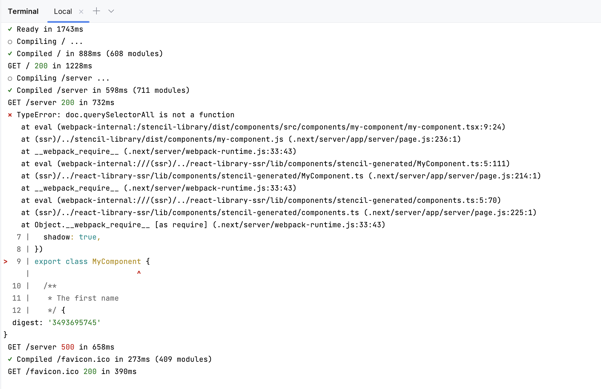

# Stencil NextJS 15 SSR and Non-SSR Example



NextJS 15, Stencil works great, but give a TypeError at development on NextJS.
`doc.querySelectorAll is not a function`

## Setup

Install all package
on root folder ->
```
npm install
```


Build projects in package with
stencil-components ->
```
npm run build
```

react-library ->
```
npm run build
```

react-library-ssr ->
```
npm run build
```

nextjs15 ->
```
npm run dev
```

Try page client with client rendering -> OK. With TypeError `doc.querySelectorAll is not a function`
http://localhost:3000/client

Try page server with server side rendering -> OK. With TypeError `doc.querySelectorAll is not a function`
http://localhost:3000/server

Both works correctly but how to prevent the TypeError? 
